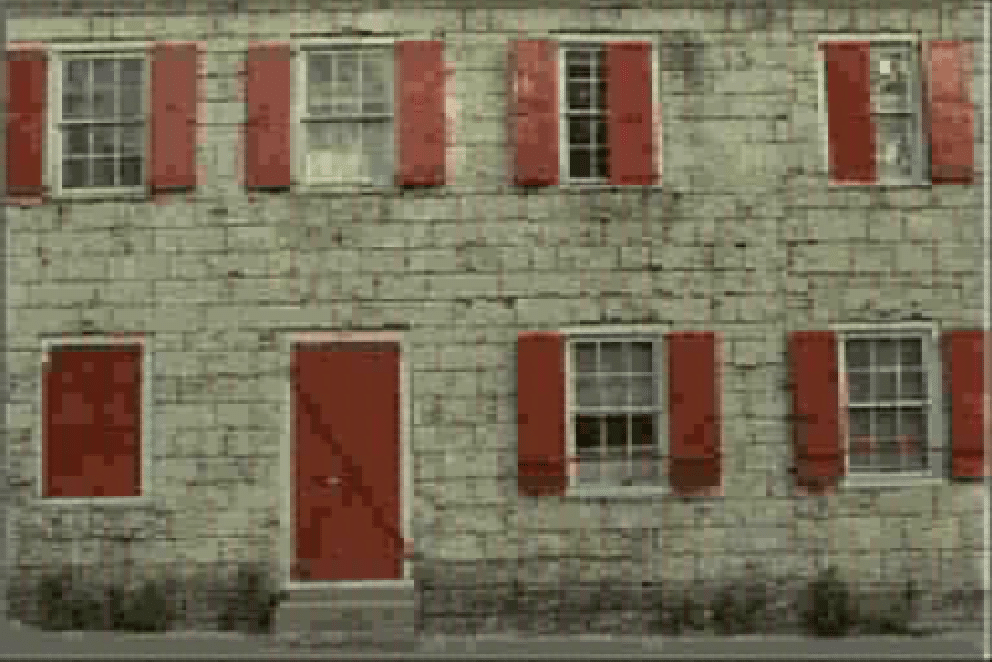

This repository provides a PyTorch implementation of **low-rank factorization (LRF) methods for data compression**. Particularly, it includes the official implementation of *"Quantization-free Lossy Image Compression Using Integer Matrix Factorization."*


<table style="border-collapse: collapse; table-layout: fixed; width: 100%;">
  <tr>
    <td style="text-align: center; border: none; width: 45%;">
      <figure style="margin: 0; padding: 0;">
        
        <figcaption>Original<br>&nbsp</figcaption>
      </figure>
    </td>
    <td style="text-align: center; border: none; width: 45%;">
      <figure style="margin: 0; padding: 0;">
        
        <figcaption>JPEG<br>(bitrate: 0.14 bpp, PSNR: 22.66 dB)</figcaption>
      </figure>
    </td>
  </tr>
  <tr>
    <td style="text-align: center; border: none; width: 45%;">
      <figure style="margin: 0; padding: 0;">
        
        <figcaption>SVD<br>(bitrate: 0.12 bpp, PSNR: 26.90 dB)</figcaption>
      </figure>
    </td>
    <td style="text-align: center; border: none; width: 45%;">
      <figure style="margin: 0; padding: 0;">
        
        <figcaption><b>IMF</b><br>(bitrate: 0.12 bpp, PSNR: 31.63 dB)</figcaption>
      </figure>
    </td>
  </tr>
</table>


## Installation

First, ensure that you have [PyTorch](https://pytorch.org/get-started/locally/) installed. The installation process may vary depending on your hardware (CPU, GPU, etc.).

Next, install the `lrf` package:

```bash
$ pip install git+https://github.com/pashtari/lrf.git
```


## Quick Start

This guide will help you get started with the integer matrix factorization (IMF) compression method using the `kodim01` image from the Kodak dataset. For a more detailed example comparing IMF against JPEG and SVD, check out [this notebook](experiments/examples/comparison.ipynb). To better understand each step of the IMF compression using visualizations, refer to [this notebook](experiments/examples/imf_pipeline.ipynb).

**Load and Visualize the Image**
```python
image = lrf.read_image("./kodim01.png")
```

**IMF Encode the Image**
```python
imf_encoded = lrf.imf_encode(
    image,
    color_space="YCbCr",
    scale_factor=(0.5, 0.5),
    quality=7,
    patch=True,
    patch_size=(8, 8),
    bounds=(-16, 15),
    dtype=torch.int8,
    num_iters=10,
)
```

**Decode the IMF Encoded Image**
```python
image_imf = lrf.imf_decode(imf_encoded)
```

**Calculate Compression Metrics**
```python
cr_value = lrf.compression_ratio(image, imf_encoded)
bpp_value = lrf.bits_per_pixel(image.shape[-2:], imf_encoded)
psnr_value = lrf.psnr(image, image_imf)
ssim_value = lrf.ssim(image, image_imf)

metrics = {
    "compression ratio": cr_value,
    "bit rate (bpp)": bpp_value,
    "PSNR (dB)": psnr_value,
    "SSIM": ssim_value,
}
print(metrics)
```

```plaintext
{
    "compression ratio": 10.5,
    "bit rate (bpp)": 0.75,
    "PSNR (dB)": 32.45,
    "SSIM": 0.95
}
```

**Visualize the Original and Compressed Images**
```python
lrf.vis_image(image, title="Original")
lrf.vis_image(
    image_imf, title=f"IMF (bit rate = {bpp_value:.2f} bpp, PSNR = {psnr_value:.2f} dB)"
)
```

<table style="border-collapse: collapse; table-layout: fixed; width: 100%;">
  <tr>
    <td style="text-align: center; border: none; width: 45%;">
      <figure style="margin: 0; padding: 0;">
        
        <figcaption>Original<br>&nbsp</figcaption>
      </figure>
    </td>
    <td style="text-align: center; border: none; width: 45%;">
      <figure style="margin: 0; padding: 0;">
        
        <figcaption>JPEG<br>(bitrate: 0.21 bpp, PSNR: 20.22 dB)</figcaption>
      </figure>
    </td>
  </tr>
  <tr>
    <td style="text-align: center; border: none; width: 45%;">
      <figure style="margin: 0; padding: 0;">
        
        <figcaption>SVD<br>(bitrate: 0.22 bpp, PSNR: 20.24 dB)</figcaption>
      </figure>
    </td>
    <td style="text-align: center; border: none; width: 45%;">
      <figure style="margin: 0; padding: 0;">
        
        <figcaption><b>IMF</b><br>(bitrate: 0.21 bpp, PSNR: 21.93 dB)</figcaption>
      </figure>
    </td>
  </tr>
</table>


## Contact
This repo is currently maintained by Pooya Ashtari ([@pashtari](https://github.com/pashtari)) and Pourya Behmandpoor ([@pourya-b](https://github.com/pourya-b)). Feel free to reach out for any queries or contributions.