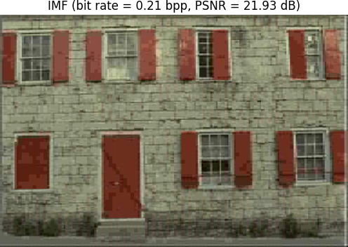

# Low-Rank Factorization (LRF) for Data Compression

This repository provides a PyTorch implementation of low-rank factorization (LRF) methods for data compression. Particularly, it includes the official implementation of "Quantization-free Lossy Image Compression Using Integer Matrix Factorization."


## Installation

First, ensure that you have [PyTorch](https://pytorch.org/get-started/locally/) installed. The installation process may vary depending on your hardware (CPU, GPU, etc.).

Next, install the `lrf` package:

```bash
$ pip install git+https://github.com/pashtari/lrf.git
```


## Quick Start

This guide will help you get started with the integer matrix factorization (IMF) compression method using the `kodim01` image from the Kodak dataset. For a more detailed example comparing IMF against JPEG and SVD, check out [this notebook](experiments/examples/comparison.ipynb). To better understand each step of the IMF compression using visualizations, refer to [this notebook](experiments/examples/imf_pipeline.ipynb).

**Load and Visualize the Image**
```python
image = lrf.read_image("./kodim01.png")
```

**IMF Encode the Image**
```python
imf_encoded = lrf.imf_encode(
    image,
    color_space="YCbCr",
    scale_factor=(0.5, 0.5),
    quality=7,
    patch=True,
    patch_size=(8, 8),
    bounds=(-16, 15),
    dtype=torch.int8,
    num_iters=10,
)
```

**Decode the IMF Encoded Image**
```python
image_imf = lrf.imf_decode(imf_encoded)
```

**Calculate Compression Metrics**
```python
cr_value = lrf.compression_ratio(image, imf_encoded)
bpp_value = lrf.bits_per_pixel(image.shape[-2:], imf_encoded)
psnr_value = lrf.psnr(image, image_imf)
ssim_value = lrf.ssim(image, image_imf)

metrics = {
    "compression ratio": cr_value,
    "bit rate (bpp)": bpp_value,
    "PSNR (dB)": psnr_value,
    "SSIM": ssim_value,
}
print(metrics)
```

```plaintext
{
    "compression ratio": 10.5,
    "bit rate (bpp)": 0.75,
    "PSNR (dB)": 32.45,
    "SSIM": 0.95
}
```

**Visualize the Original and Compressed Images**
```python
lrf.vis_image(image, title="Original")
lrf.vis_image(
    image_imf, title=f"IMF (bit rate = {bpp_value:.2f} bpp, PSNR = {psnr_value:.2f} dB)"
)
```

 

## Contact
This repo is currently maintained by Pooya Ashtari ([@pashtari](https://github.com/pashtari)) and Pourya Behmandpoor ([@pourya-b](https://github.com/pourya-b)). Feel free to reach out for any queries or contributions.